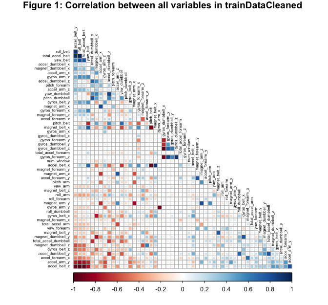
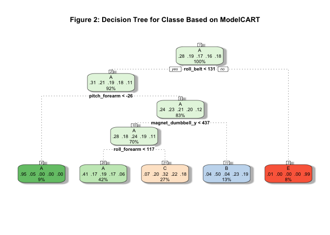
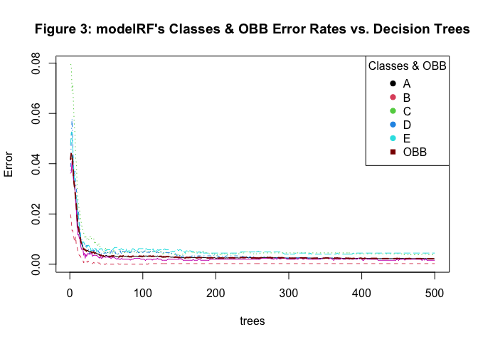

## Background

Using devices such as Jawbone Up, Nike FuelBand, and Fitbit it is now
possible to collect a large amount of data about personal activity
relatively inexpensively. These type of devices are part of the
quantified self movement – a group of enthusiasts who take measurements
about themselves regularly to improve their health, to find patterns in
their behavior, or because they are tech geeks. One thing that people
regularly do is quantify how much of a particular activity they do, but
they rarely quantify how well they do it. This project collected data
from accelerometers on the belt, forearm, arm, and dumbell of 6
participants. They were asked to perform barbell lifts correctly and
incorrectly in 5 different ways. More information is available from the
project’s website here: <http://groupware.les.inf.puc-rio.br/har>.

## Overview

The goal of this report is to build a predictive model to predict the
manner in which the 6 participants did the exercise (this is given as
the *classe* variable in the provided training dataset). The report
shows how the predictive models were built, and how cross validation was
used. It shows which predictive model is chosen, and what is the model’s
accuracy and expected out of sample error. Finally, the report presents
the predicted *classe* values for a testing dataset that was never used
in training of the chosen predictive model.

## Setup the Environment

This section discusses the required libraries needed to run the R code
listed in this report, and loaded to produce the results it shows. The
listed code in this section, also, loads the required datasets from the
specified URLs, and performs a number of data cleaning tasks related to
removing columns/variables: 1) with 90% missing values; 2) have no
variability; or 3) useless to the analysis, such as user\_names and
timestamps raw columns.

    # loading required libraries
    library(data.table) ; library(caret) ; library(corrplot) 
    library(rpart) ; library(rattle) ; library(randomForest) ; library(gbm)  

    trainData <- as.data.frame(fread("https://d396qusza40orc.cloudfront.net/predmachlearn/pml-training.csv", header=TRUE, na.strings=c("NA",  " ", "", "#DIV/0!")))
    testData  <- as.data.frame(fread("https://d396qusza40orc.cloudfront.net/predmachlearn/pml-testing.csv", header=TRUE, na.strings=c("NA",  " ", "", "#DIV/0!")))

The dimensions of the provided original datasets for this project:

<table>
<colgroup>
<col style="width: 33%" />
<col style="width: 33%" />
<col style="width: 33%" />
</colgroup>
<thead>
<tr>
<th style="text-align: center;">dataset</th>
<th style="text-align: center;">Number of observations (rows)</th>
<th style="text-align: center;">Number of variables (Columns)</th>
</tr>
</thead>
<tbody>
<tr>
<td style="text-align: center;"><em>trainData</em></td>
<td style="text-align: center;">19622</td>
<td style="text-align: center;">160</td>
</tr>
<tr>
<td style="text-align: center;"><em>testData</em></td>
<td style="text-align: center;">20</td>
<td style="text-align: center;">160</td>
</tr>
</tbody>
</table>

    # clean datasets by removing columns/vars with 90% missing values, or no variability
    naColToRemove <- which(colSums(is.na(trainData))>0.9*nrow(trainData))                            
    trainDataCleaned <- trainData[, -naColToRemove]
    testDataCleaned <- testData[, -naColToRemove]
    NZV <- nearZeroVar(trainDataCleaned, saveMetrics = TRUE)
    trainDataCleaned <- trainDataCleaned[, !NZV$nzv]
    testDataCleaned <- testDataCleaned[, !NZV$nzv]
    trainDataCleaned <- trainDataCleaned[,-c(1:5)]      # remove user_name & raw timestamps cols
    trainDataCleaned$classe <- as.factor(trainDataCleaned$classe) # set classe as a factor 
    testDataCleaned <- testDataCleaned[,-c(1:5,59)]     # remove user_name & raw timestamps cols
    testing <- testDataCleaned                          # renaming the testDataCleaned

This makes the *testDataCleaned* and *testing* datasets have the
following dimensions. The *testing* set does not include the *classe*
variable/column, which the *testDataCleaned* has. Hence its variables
count is less by one. This variable should be predicted by the chosen
predictive model.

<table>
<colgroup>
<col style="width: 33%" />
<col style="width: 33%" />
<col style="width: 33%" />
</colgroup>
<thead>
<tr>
<th style="text-align: center;">dataset</th>
<th style="text-align: center;">Number of observations (rows)</th>
<th style="text-align: center;">Number of variables (Columns)</th>
</tr>
</thead>
<tbody>
<tr>
<td style="text-align: center;"><em>trainDataCleaned</em></td>
<td style="text-align: center;">19622</td>
<td style="text-align: center;">54</td>
</tr>
<tr>
<td style="text-align: center;"><em>testing (testDataCleaned)</em></td>
<td style="text-align: center;">20</td>
<td style="text-align: center;">53</td>
</tr>
</tbody>
</table>

## Data Exploratory Analysis

A correlation analysis reveals that very few variables are correlated,
as shown in Figure 1. The figure also shows the level of correlation
among such variables.

    corrplot(cor(subset(trainDataCleaned, select = -c(classe))), method = 'square', order = 'FPC', type = 'lower', diag = FALSE, tl.col = "black", tl.cex = 0.5, title="Figure 1: Correlation between all variables in trainDataCleaned ",mar=c(0,0,1,0)) 

## Partitioning Training Set to Training and Validation Sets

Cross-validation is one of the best practices of study design. It
requires leaving the *testing* dataset for final testing of the
predictive models, and not use it to train the models. This requires
spiting the *training* dataset (*trainDataCleaned*) to a *training*
(70%) and a *validation* (30%) datasets. This step isolates the models’
final testing (where the *testing* dataset will be used), and separates
it, from the models’ training activities, such as: training the models,
predicting their outcomes, calculating their accuracy and error
estimates, and finally choosing the best model.

    set.seed(1357) # For reproducibility purposes
    inTrain <- createDataPartition(trainDataCleaned$classe, p = 0.70, list = FALSE)
    training <- trainDataCleaned[inTrain, ]
    validation <- trainDataCleaned[-inTrain, ]

<table>
<colgroup>
<col style="width: 33%" />
<col style="width: 33%" />
<col style="width: 33%" />
</colgroup>
<thead>
<tr>
<th style="text-align: center;">dataset</th>
<th style="text-align: center;">Number of observations (rows)</th>
<th style="text-align: center;">Number of variables (Columns)</th>
</tr>
</thead>
<tbody>
<tr>
<td style="text-align: center;"><em>training</em></td>
<td style="text-align: center;">13737</td>
<td style="text-align: center;">54</td>
</tr>
<tr>
<td style="text-align: center;"><em>validation</em></td>
<td style="text-align: center;">5885</td>
<td style="text-align: center;">54</td>
</tr>
</tbody>
</table>

## Building Predictive Models

Three predictive modeling methods were used to fit a predictive model
for the *classe* variable.

#### 1) Building a Predictive Model based on the Classification and Regression Trees (CART) method

    modelCART <- train(classe ~., data=training, method="rpart")
    predictCART <- predict(modelCART, validation)
    confusionMatrix(predictCART, validation$classe)

    ## Confusion Matrix and Statistics
    ## 
    ##           Reference
    ## Prediction    A    B    C    D    E
    ##          A 1505  457  482  392  142
    ##          B   25  391   35  172  165
    ##          C  140  291  509  400  272
    ##          D    0    0    0    0    0
    ##          E    4    0    0    0  503
    ## 
    ## Overall Statistics
    ##                                          
    ##                Accuracy : 0.4941         
    ##                  95% CI : (0.4813, 0.507)
    ##     No Information Rate : 0.2845         
    ##     P-Value [Acc > NIR] : < 2.2e-16      
    ##                                          
    ##                   Kappa : 0.3401         
    ##                                          
    ##  Mcnemar's Test P-Value : NA             
    ## 
    ## Statistics by Class:
    ## 
    ##                      Class: A Class: B Class: C Class: D Class: E
    ## Sensitivity            0.8990  0.34328  0.49610   0.0000  0.46488
    ## Specificity            0.6502  0.91635  0.77300   1.0000  0.99917
    ## Pos Pred Value         0.5054  0.49619  0.31576      NaN  0.99211
    ## Neg Pred Value         0.9419  0.85325  0.87901   0.8362  0.89234
    ## Prevalence             0.2845  0.19354  0.17434   0.1638  0.18386
    ## Detection Rate         0.2557  0.06644  0.08649   0.0000  0.08547
    ## Detection Prevalence   0.5060  0.13390  0.27392   0.0000  0.08615
    ## Balanced Accuracy      0.7746  0.62982  0.63455   0.5000  0.73202

    fancyRpartPlot(modelCART$finalModel, sub="", main="Figure 2: Decision Tree for Classe Based on ModelCART")

#### 2) Building a Predictive Model based on the Random Forest method

    modelRF <- train(classe ~., data=training, method="rf", trcontrol = trainControl(method="cv", number=3))
    predictRF <- predict(modelRF, validation)
    confusionMatrix(predictRF, validation$classe)

    ## Confusion Matrix and Statistics
    ## 
    ##           Reference
    ## Prediction    A    B    C    D    E
    ##          A 1674    6    0    0    0
    ##          B    0 1131    3    0    0
    ##          C    0    1 1023    6    0
    ##          D    0    1    0  958    1
    ##          E    0    0    0    0 1081
    ## 
    ## Overall Statistics
    ##                                           
    ##                Accuracy : 0.9969          
    ##                  95% CI : (0.9952, 0.9982)
    ##     No Information Rate : 0.2845          
    ##     P-Value [Acc > NIR] : < 2.2e-16       
    ##                                           
    ##                   Kappa : 0.9961          
    ##                                           
    ##  Mcnemar's Test P-Value : NA              
    ## 
    ## Statistics by Class:
    ## 
    ##                      Class: A Class: B Class: C Class: D Class: E
    ## Sensitivity            1.0000   0.9930   0.9971   0.9938   0.9991
    ## Specificity            0.9986   0.9994   0.9986   0.9996   1.0000
    ## Pos Pred Value         0.9964   0.9974   0.9932   0.9979   1.0000
    ## Neg Pred Value         1.0000   0.9983   0.9994   0.9988   0.9998
    ## Prevalence             0.2845   0.1935   0.1743   0.1638   0.1839
    ## Detection Rate         0.2845   0.1922   0.1738   0.1628   0.1837
    ## Detection Prevalence   0.2855   0.1927   0.1750   0.1631   0.1837
    ## Balanced Accuracy      0.9993   0.9962   0.9978   0.9967   0.9995

#### 3) Building a Predictive Model based on the Gradient Boosting Machine (GBM) method

    modelGBM <- train(classe ~., data=training, method="gbm", verbose = FALSE)
    predictGBM <- predict(modelGBM, validation)
    confusionMatrix(predictGBM, validation$classe)

    ## Confusion Matrix and Statistics
    ## 
    ##           Reference
    ## Prediction    A    B    C    D    E
    ##          A 1664   16    0    0    0
    ##          B    9 1109    5    4    3
    ##          C    1   14 1017   15    0
    ##          D    0    0    4  943    8
    ##          E    0    0    0    2 1071
    ## 
    ## Overall Statistics
    ##                                           
    ##                Accuracy : 0.9862          
    ##                  95% CI : (0.9829, 0.9891)
    ##     No Information Rate : 0.2845          
    ##     P-Value [Acc > NIR] : < 2.2e-16       
    ##                                           
    ##                   Kappa : 0.9826          
    ##                                           
    ##  Mcnemar's Test P-Value : NA              
    ## 
    ## Statistics by Class:
    ## 
    ##                      Class: A Class: B Class: C Class: D Class: E
    ## Sensitivity            0.9940   0.9737   0.9912   0.9782   0.9898
    ## Specificity            0.9962   0.9956   0.9938   0.9976   0.9996
    ## Pos Pred Value         0.9905   0.9814   0.9713   0.9874   0.9981
    ## Neg Pred Value         0.9976   0.9937   0.9981   0.9957   0.9977
    ## Prevalence             0.2845   0.1935   0.1743   0.1638   0.1839
    ## Detection Rate         0.2828   0.1884   0.1728   0.1602   0.1820
    ## Detection Prevalence   0.2855   0.1920   0.1779   0.1623   0.1823
    ## Balanced Accuracy      0.9951   0.9846   0.9925   0.9879   0.9947

## Evaluating the Predictive Models and Choosing the Best One

The prediction accuracy of the models, as shown above:

<table>
<thead>
<tr>
<th style="text-align: center;"></th>
<th style="text-align: center;">Predictive Model</th>
<th style="text-align: center;">Method Used</th>
<th style="text-align: center;">Accuracy</th>
</tr>
</thead>
<tbody>
<tr>
<td style="text-align: center;">1</td>
<td style="text-align: center;">modelCART</td>
<td style="text-align: center;">Classification and Regression Trees
(CART)</td>
<td style="text-align: center;">49.41%</td>
</tr>
<tr>
<td style="text-align: center;">2</td>
<td style="text-align: center;">modelRF</td>
<td style="text-align: center;">Random Forest (RF)</td>
<td style="text-align: center;">99.69%</td>
</tr>
<tr>
<td style="text-align: center;">3</td>
<td style="text-align: center;">modelGBM</td>
<td style="text-align: center;">Gradient Boosting Machine (GBM)</td>
<td style="text-align: center;">98.62%</td>
</tr>
</tbody>
</table>

Both the Random Forest model (modelRF) and the GBM model (modelGBM)
provided high accuracy scores for predicting the *classe* variable in
the *validation* dataset, after been trained using the *training*
dataset. The CART model scored badly, as one can see from the results
above. Therefore, modelRF and modelGBM both, equally, could be used to
predict the *classe* variable in the testing test. In this report, **the
predictive model built using the Random Forest method, modelRF, is
chosen because its accuracy is slightly better, but more importantly
because building it was less computationally demanding than the GBM
model building**. it took less time to build modelRF than modelGBM.

Further accuracy and error estimation analysis of the predictive model
built using the random forest method, modelRF, was conducted. Details of
modelRF’s error estimates, in general (OBB) and per *classe*’s classes;
and a plot of these error estimates versus the 500 model trees are
provided here.

    modelRF$finalModel

    ## 
    ## Call:
    ##  randomForest(x = x, y = y, mtry = param$mtry, trcontrol = ..1) 
    ##                Type of random forest: classification
    ##                      Number of trees: 500
    ## No. of variables tried at each split: 27
    ## 
    ##         OOB estimate of  error rate: 0.22%
    ## Confusion matrix:
    ##      A    B    C    D    E  class.error
    ## A 3905    0    0    0    1 0.0002560164
    ## B    7 2648    3    0    0 0.0037622272
    ## C    0    5 2391    0    0 0.0020868114
    ## D    0    0   10 2242    0 0.0044404973
    ## E    0    1    0    3 2521 0.0015841584

    plot(modelRF$finalModel, main="Figure 3: modelRF's Classes & OBB Error Rates vs. Decision Trees")
    lines(x = 1:500, y = modelRF$finalModel$err.rate[,1], col = "darkred", lty = 2, lwd = 2)
    legend("topright", legend = c(modelRF$finalModel$classes, "OBB"), col = c(1:length(modelRF$finalModel$classes), "darkred"), pch = c(19,19,19,19,19,15), title = "Classes & OBB", bty = "o")

Figure 3 displays plots of the relationship between modelRF’s error
estimates (for each class in the *classe* variable and the generalized
Out-of-Bag (OOB) error estimate) and the decision trees built and used
by the Random Forest method to build modelRF. The plot shows that,
initially, as more trees are added the error rates drops sharply. This
is because the model benefits from combining multiple semi-independent
individual decision trees, which reduces variance and improves the
overall prediction accuracy. Then, the model’s error curves flatten out,
converged and stabilized. This indicates that adding more trees beyond
this point no longer significantly improves the model’s performance.

In addition, the modelRF$finalModel results show the Out-of-Bag (OOB)
error estimate, which is an unbiased estimate of the generalization
error of how well the model will perform on new unseen data (including
the *validation* dataset which is not used in the model building
activity of modelRF) = 0.2%.

Finally, when the *validation* dataset is used to predict the *classe*
variable, modelRF performed as expected with the actual accuracy =
99.69% , and the actual out of sample (training sample) error = 0.31%.

## Using the Selected Predictive Model on the Testing Dataset

The predictive model built using the Random Forest method, modelRF, is
used here to predict the values of the *classe* variable for each of the
20 observations (rows) in the *testing* set, downloaded and cleaned
above.

    predict(modelRF, newdata = testing)

    ##  [1] B A B A A E D B A A B C B A E E A B B B
    ## Levels: A B C D E
